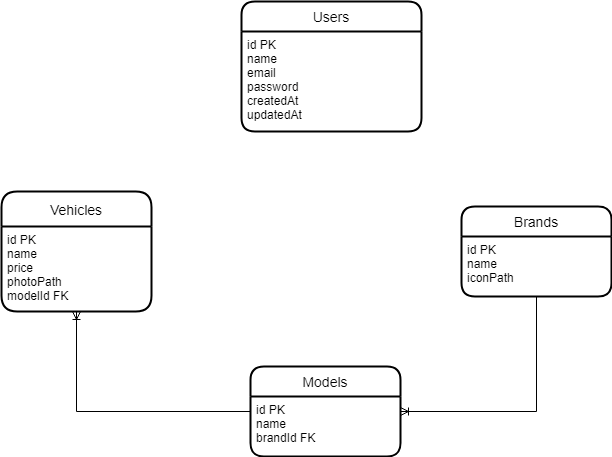
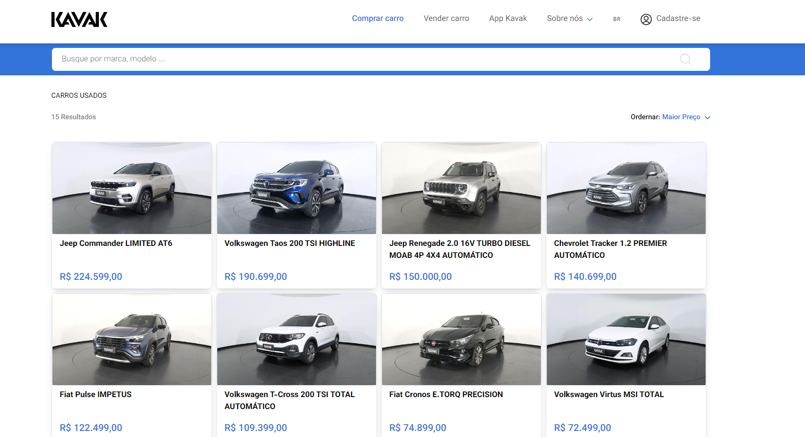
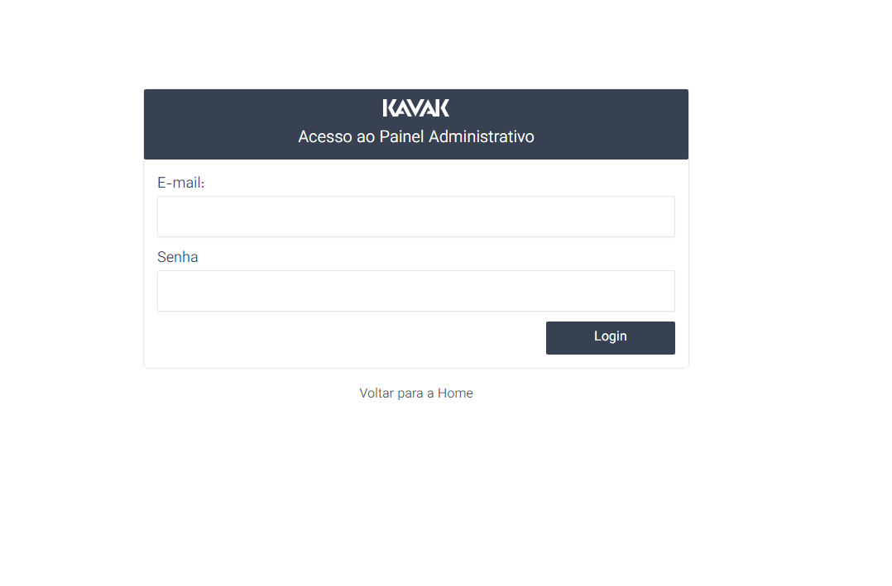
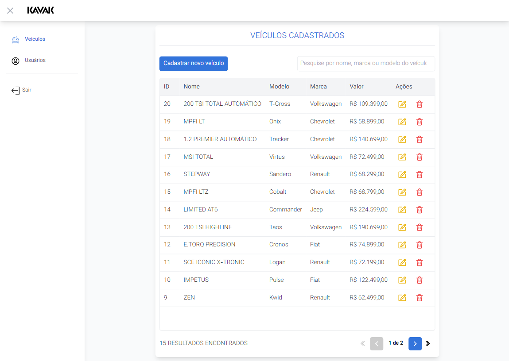
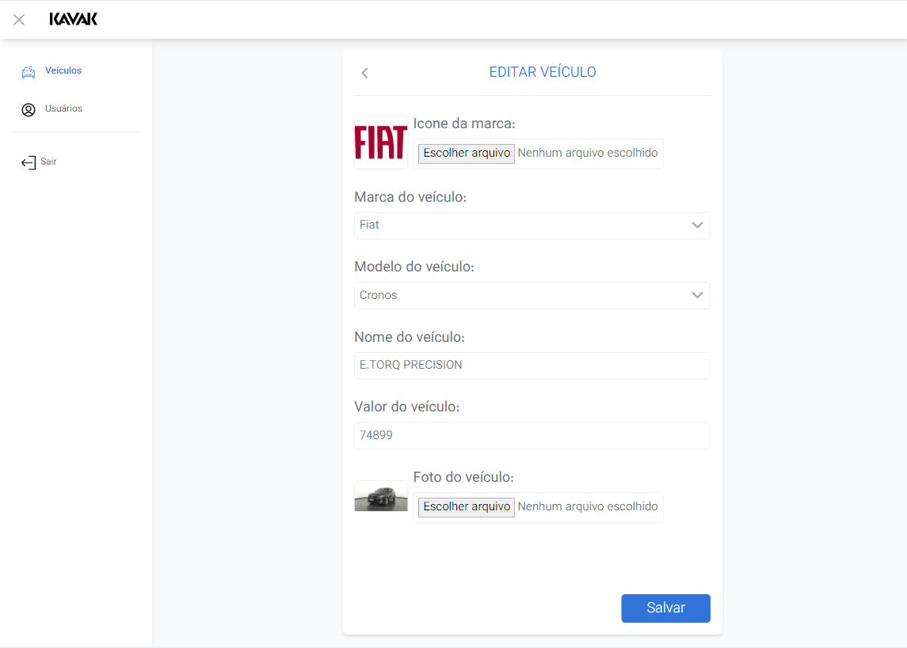
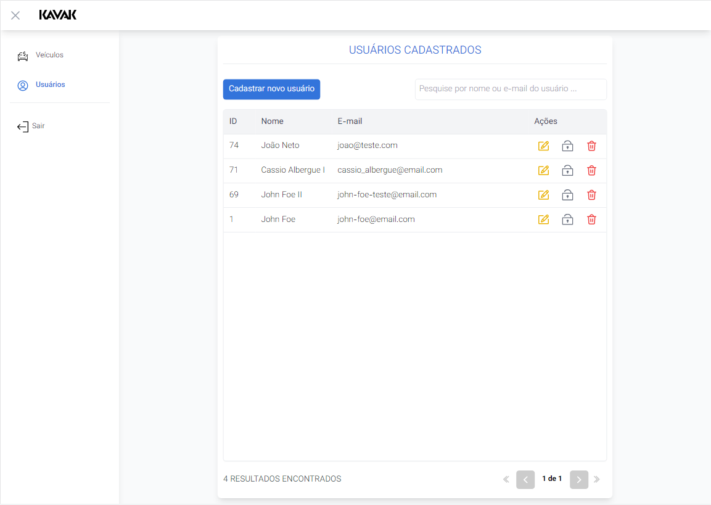

# Teste Prático Fullstack JS

Teste com proposta de validar os conhecimentos técnicos em desenvolvimento frontend, backend e entendimento de projeto.

## Sumário

1. [Objetivo](#objetivo)
2. [Tecnologias utilizadas](#tecnologias-utilizadas)
3. [Depedências externas](#depedências-externas)
4. [Pré-requisitos para executar este projeto](#pré-requisitos-para-executar-este-projeto)
5. [Como executar](#como-executar)
6. [URL](#url)
7. [Documentação](#documentação)
   1. [Banco de dados](#banco-de-dados)
   2. [API](#api)
   3. [Frontend](#frontend)
8. [Pontos a melhorar](#pontos-a-melhorar)

## Objetivo

Desenvolver um sistema como um catálogo de veículos a venda.

## Tecnologias utilizadas

- Nest.js (Back-end)
- Angular (Front-end)
- Postgres
- Docker

## Depedências externas

- [Uploadcare](https://uploadcare.com/): Serviço em cloud gratuito utilizado para storage de arquivos (S3 Gratuito).

## Pré-requisitos para executar este projeto

1. Deve possuir o docker instalado na máquina

## Como executar

Após clonar o projeto, rodar o comando a seguir para subir as imagens do aplicativo:

```sh
docker compose up
```

> **Obs:** _O uso do flag -d é ocultada para termos visualização dos logs de uma maneira mais prática_

## URL

- [API](http://localhost:3000/api/v1): http://localhost:3000/api/v1
- [Front-end](http://localhost:8080/): http://localhost:8080/

## Documentação

### Banco de dados

O banco de dados selecionado foi o banco de dados relacional Postgres, pois foi decidido que um banco estruturado faz mais sentido neste projeto.

- **Modelo Entidade-Relacionamento**:

<div align="center">
  
</div>

### API

O Backend do projeto foi desenvolvida em Nest.js e possui 5 modulos principais no total:

- Usuários
- Marcas
- Modelos
- Veículos
- Autenticação

Mais detalhes dos endpoints possíveis e seus paramêtros foram disponibilizadas por meio do _Swagger_ e pode ser acesso nesta URL após subir as imagens do docker: [Documentação Swagger](http://localhost:3000/api/v1/docs)

### Frontend

O Frontend do projeto, por sua vez, foi desenvolvido em Angular e está disponível para ser acessado através do servidor web Nginx já instalado e configurado no momento da criação das imagens do Docker.

Esta aplicação possui duas áreas, uma sendo publica e outra restrita para usuários autenticados.

**Rotas da aplicação**

**/** - Home da aplicação, local onde é apresentado a vitrine dos veículos:

<div align="center">
  
</div>

---

**/admin/login** - Tela de login para acesso ao painel administrativo:

<div align="center">
  
</div>

---

**/admin/veiculos** - Tela responsável por realizar o gerenciamento de veículos, possui função de listagem, cadastro, edição e remoção de um veículo:

<div align="center">
  
  &nbsp;&nbsp;&nbsp;
  
</div>

---

**/admin/usuarios** - Tela responsável por realizar o gerenciamento de usuários, possui função de listagem, cadastro, edição e remoção de um veículo:

<div align="center">
  
  &nbsp;&nbsp;&nbsp;
  
</div>

## Pontos a melhorar

1. **Validação**: O projeto cobre apenas o cenário perfeito e carece de validações mais profundas;

2. **Refatoração**: O código fonte do projeto, em especial o Front-end possui muito espaço para refatorações e melhorias.

3. **Filtro lateral de marcas e modelos**: Em virtude do tempo, o codigo estático do filtro a parte lateral da home esta presente no código fonte, porém sem funcionar corretamente, por isso, foi ocultado do resultado final, sendo portanto, mais um ponto a melhorar neste aplicativo.
